# Secure Twitter — Microservices with Auth0 and AWS

**Team:** Elizabeth Correa Suarez, Sebastian Ortega Muñoz, Jeimy Yaya  
**Course:** TDSE

---

 The system allows authenticated users to create short posts (maximum 140 characters) visible in a single public stream. The project was built in two phases: a Spring Boot monolith secured with Auth0, followed by a migration to three independent serverless microservices deployed on AWS Lambda.

---

## Table of Contents

1. [Project Description](#1-project-description)
2. [Architecture Overview](#2-architecture-overview)
   - [Phase 1 — Monolith](#phase-1--monolith)
   - [Phase 2 — Microservices on AWS](#phase-2--microservices-on-aws)
3. [Security Design — Auth0 and JWT](#3-security-design--auth0-and-jwt)
4. [API Reference](#4-api-reference)
5. [Local Setup and Execution](#5-local-setup-and-execution)
   - [Prerequisites](#prerequisites)
   - [Running the Monolith](#running-the-monolith)
   - [Running the Frontend Locally](#running-the-frontend-locally)
6. [AWS Deployment](#6-aws-deployment)
7. [Test Report](#7-test-report)
8. [Live Links](#8-live-links)
9. [Video Demonstration](#9-video-demonstration)

---

## 1. Project Description

Secure Twitter is a full-stack web application that replicates the core flow of a microblogging platform:

- Users authenticate via **Auth0** using their Google account or email/password
- Authenticated users can **create posts** of up to 140 characters
- All users (including unauthenticated visitors) can **view the public stream** of posts
- Authenticated users can **retrieve their own profile** via `/api/me`

The application was built in two distinct phases to demonstrate the evolution from a traditional monolithic architecture to a cloud-native, serverless microservices architecture.

### Tech Stack

| Layer | Technology |
|---|---|
| Monolith Backend | Java 17, Spring Boot 3.x, Maven |
| Security | Auth0, Spring Security OAuth2 Resource Server |
| Database | PostgreSQL 16 |
| ORM | Spring Data JPA / Hibernate |
| API Documentation | springdoc-openapi (Swagger UI) |
| Frontend | React 18, Vite, @auth0/auth0-react |
| Microservices | AWS Lambda (Java 17, Spring Boot + Serverless Container) |
| API Gateway | AWS API Gateway HTTP API |
| Frontend Hosting | Vercel |

---

## 2. Architecture Overview

### Phase 1 — Monolith

The first phase implements all functionality in a single Spring Boot application. The frontend communicates directly with the monolith, which validates JWT tokens issued by Auth0 and connects to a PostgreSQL database.

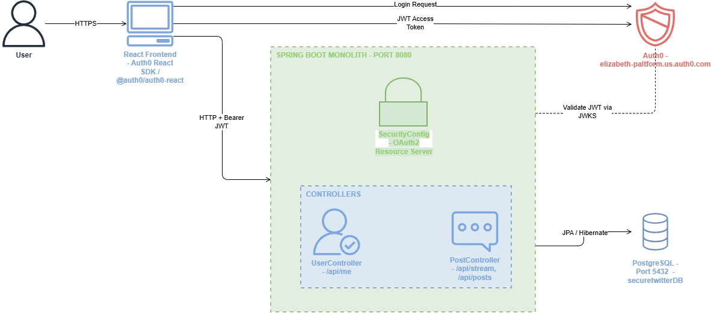

**Key components:**

- `PostController` — handles `GET /api/stream`, `GET /api/posts`, `POST /api/posts`
- `UserController` — handles `GET /api/me`
- `SecurityConfig` — configures Spring Security as an OAuth2 Resource Server, validates JWT issuer and audience
- `PostRepository` / `UserRepository` — Spring Data JPA interfaces for database access

---

### Phase 2 — Microservices on AWS

The monolith was refactored into three independent Lambda functions, each responsible for a single domain. All functions share the same PostgreSQL database on RDS and are exposed through a single API Gateway endpoint.

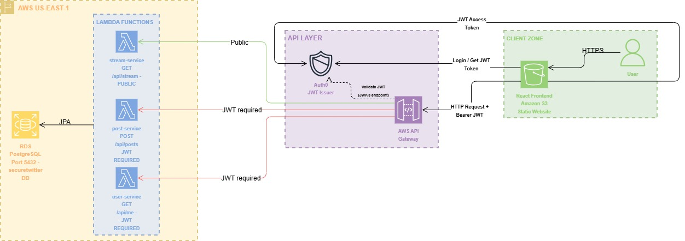

**Service breakdown:**

| Service | Lambda Function | Routes | Auth Required |
|---|---|---|---|
| Stream Service | `secure-twitter-stream` | `GET /api/stream`, `GET /api/posts` | No |
| Post Service | `secure-twitter-post` | `POST /api/posts` | Yes — Bearer JWT |
| User Service | `secure-twitter-user` | `GET /api/me` | Yes — Bearer JWT |

Each Lambda function is a self-contained Spring Boot application packaged as an uber-JAR using the AWS Serverless Java Container adapter.

**AWS infrastructure:**

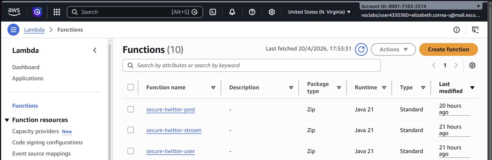

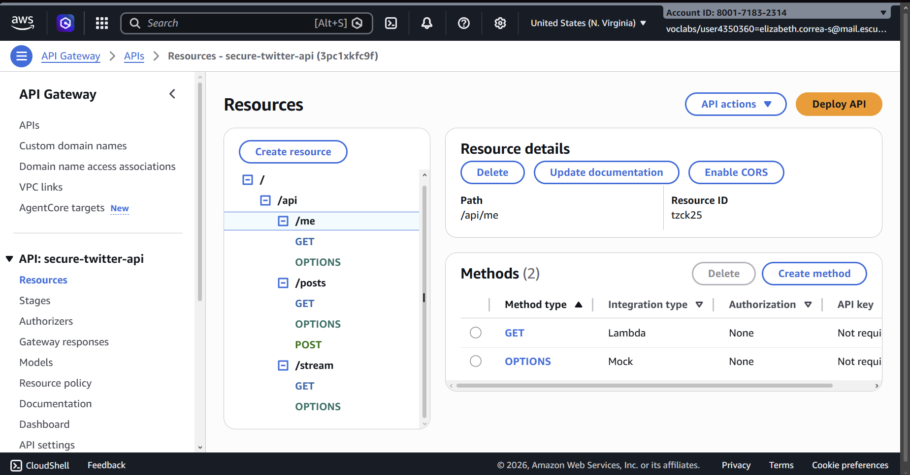

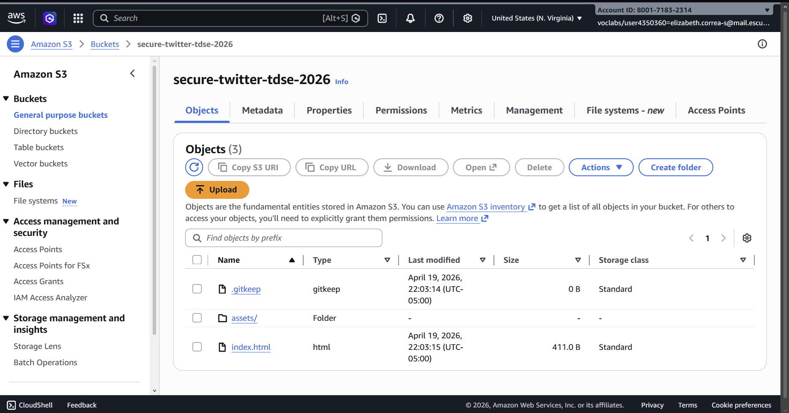

---

## 3. Security Design — Auth0 and JWT

Auth0 acts as the identity provider for the entire system. The security flow is:

1. The user clicks Login in the React frontend
2. The frontend redirects to Auth0's hosted login page using the Auth0 React SDK
3. After successful authentication, Auth0 issues a signed **JWT Access Token** with the configured audience (`https://secure-twitter-api`)
4. The frontend stores the token and sends it as a `Bearer` header on every protected request
5. The backend (monolith or Lambda) validates the token against Auth0's JWKS endpoint and enforces the correct audience

**Auth0 configuration:**

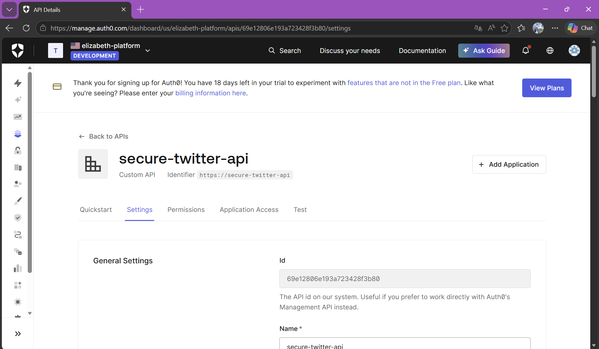

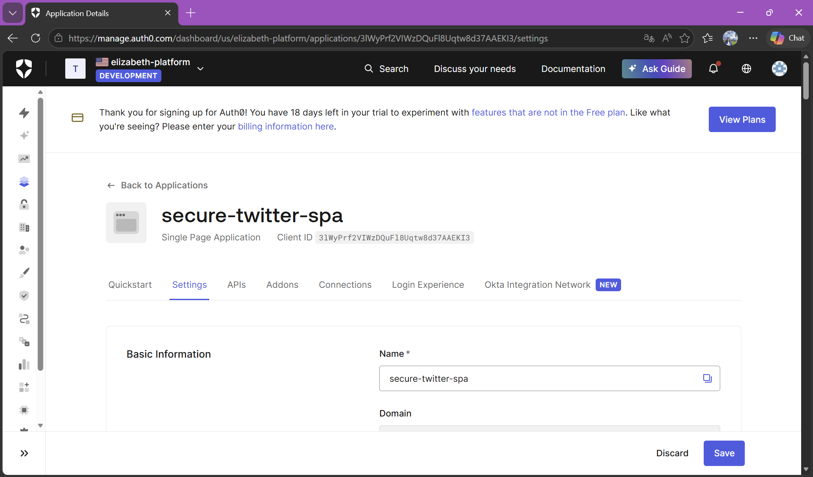

| Parameter | Value |
|---|---|
| Auth0 Domain | `elizabeth-platform.us.auth0.com` |
| Audience | `https://secure-twitter-api` |
| Token Type | JWT (RS256) |
| Token Storage | localStorage (with silent refresh) |

**Protected vs public endpoints:**

| Endpoint | Auth Required | How it is enforced |
|---|---|---|
| `GET /api/stream` | No | Permitted for all in `SecurityConfig` |
| `GET /api/posts` | No | Permitted for all in `SecurityConfig` |
| `POST /api/posts` | Yes | Requires valid JWT with correct audience |
| `GET /api/me` | Yes | Requires valid JWT with correct audience |

---

## 4. API Reference

### Swagger UI — Monolith

The monolith exposes a full OpenAPI 3.0 specification via springdoc-openapi.

- **Local:** `http://localhost:8080/swagger-ui/index.html`
- **API Docs (JSON):** `http://localhost:8080/v3/api-docs`

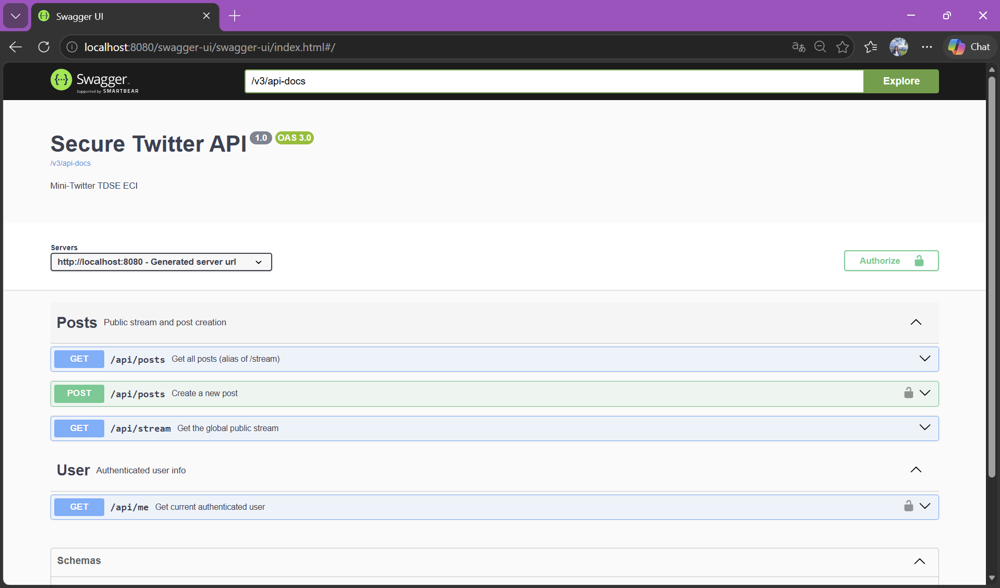

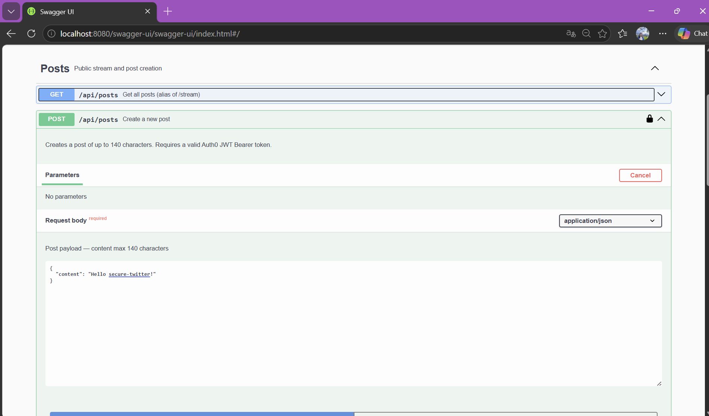

To test protected endpoints in Swagger UI, click **Authorize** and paste a valid JWT Access Token obtained from Auth0.

### Microservices API (AWS)

**Base URL:** `https://3pc1xkfc9f.execute-api.us-east-1.amazonaws.com/prod`

| Method | Endpoint | Auth | Description |
|---|---|---|---|
| `GET` | `/api/stream` | No | Returns all posts ordered by date descending |
| `GET` | `/api/posts` | No | Alias of `/api/stream`, supports pagination |
| `POST` | `/api/posts` | Bearer JWT | Creates a new post (max 140 characters) |
| `GET` | `/api/me` | Bearer JWT | Returns the authenticated user's profile |

**POST /api/posts — Request body:**
```json
{
  "content": "Your post text here (max 140 characters)"
}
```

**GET /api/stream — Response example:**
```json
[
  {
    "id": "uuid",
    "content": "Hello from Secure Twitter",
    "authorUsername": "elizabeth",
    "createdAt": "2025-04-21T10:30:00Z"
  }
]
```

**GET /api/me — Response example:**
```json
{
  "id": "uuid",
  "auth0Id": "auth0|abc123",
  "email": "user@example.com",
  "username": "elizabeth",
  "createdAt": "2025-04-21T09:00:00Z"
}
```

---

## 5. Local Setup and Execution

### Prerequisites

| Tool | Version |
|---|---|
| Java | 17 or higher |
| Maven | 3.8+ |
| Node.js | 18+ |
| Docker | 24+ (for PostgreSQL) |
| Git | Any recent version |

### Running the Monolith

**1. Clone the repository**
```bash
git clone https://github.com/Eliza-05/secure-twitter-microservices.git
cd secure-twitter-microservices/monolith
```

**2. Start PostgreSQL with Docker**
```bash
docker-compose up -d
```

This starts a PostgreSQL 16 instance on `localhost:5432` with database `securetwitter`, user `postgres`, password `postgres`.

**3. Configure environment variables**

Create a file `src/main/resources/application-local.properties` with:
```properties
spring.datasource.url=jdbc:postgresql://localhost:5432/securetwitter
spring.datasource.username=postgres
spring.datasource.password=postgres
spring.security.oauth2.resourceserver.jwt.issuer-uri=https://elizabeth-platform.us.auth0.com/
auth0.audience=https://secure-twitter-api
```

**4. Run the application**
```bash
mvn spring-boot:run -Dspring-boot.run.profiles=local
```

The monolith starts at `http://localhost:8080`.  
Swagger UI is available at `http://localhost:8080/swagger-ui/index.html`.

---

### Running the Frontend Locally

**1. Navigate to the frontend folder**
```bash
cd ../frontend
```

**2. Install dependencies**
```bash
npm install
```

**3. Configure environment variables**

Create a `.env.local` file:
```env
VITE_AUTH0_DOMAIN=elizabeth-platform.us.auth0.com
VITE_AUTH0_CLIENT_ID=3lWyPrf2VIWzDQuFl8Uqtw8d37AAEKI3
VITE_AUTH0_AUDIENCE=https://secure-twitter-api
VITE_API_BASE_URL=http://localhost:8080
```

> `VITE_API_BASE_URL` always points to the **backend API**, not the frontend host. In local development it points to the monolith (`http://localhost:8080`). In production it points to the AWS API Gateway URL.

To point the frontend at the deployed AWS microservices instead, set:
```env
VITE_API_BASE_URL=https://3pc1xkfc9f.execute-api.us-east-1.amazonaws.com/prod
```

**4. Start the development server**
```bash
npm run dev
```

The frontend starts at `http://localhost:3000`.

---

## 6. AWS Deployment

The microservices were deployed manually through the **AWS Management Console**. No infrastructure-as-code tool (SAM, CDK, Terraform) was used — each resource was created step by step from the web interface.

**Lambda functions**

Each microservice was packaged as an uber-JAR (`mvn package`) and uploaded directly to a Lambda function created from the console:

1. Open **AWS Lambda** → Create function → Author from scratch
2. Runtime: Java 17, Architecture: x86_64
3. Upload the JAR file under the Code tab
4. Set the handler to the corresponding class (e.g. `edu.eci.tdse.securetwitter.stream.LambdaHandler::handleRequest`)
5. Add environment variables: database URL, credentials, Auth0 domain and audience

This was repeated for each of the three functions: `secure-twitter-stream`, `secure-twitter-post`, and `secure-twitter-user`.

**API Gateway**

1. Open **AWS API Gateway** → Create API → HTTP API
2. Add integrations pointing to each Lambda function
3. Define the routes:
   - `GET /api/stream` → stream-service
   - `GET /api/posts` → stream-service
   - `POST /api/posts` → post-service
   - `GET /api/me` → user-service
4. Configure CORS to allow requests from the Vercel frontend origin
5. Deploy to a stage named `prod`


**Frontend deployment — Vercel**

The frontend is deployed on **Vercel** instead of Amazon S3. The original plan was to host the static build on S3 with Static Website Hosting enabled, but S3 static websites are served over plain HTTP. Auth0 enforces HTTPS for all Allowed Callback URLs and Allowed Logout URLs, so the authentication flow failed silently — after login, Auth0 would not redirect back to an HTTP origin.

The alternative was to add **Amazon CloudFront** in front of S3 to serve the site over HTTPS, but the IAM role available in the lab environment (`LabRole`) does not have permission to create or attach CloudFront distributions. Given the time constraint, the frontend was deployed to Vercel, which provides HTTPS automatically at no cost.

```bash
cd frontend
npm run build
# then connect the repository to Vercel and set the environment variables in the Vercel dashboard
```

**Vercel environment variables (set in dashboard):**
```env
VITE_AUTH0_DOMAIN=elizabeth-platform.us.auth0.com
VITE_AUTH0_CLIENT_ID=3lWyPrf2VIWzDQuFl8Uqtw8d37AAEKI3
VITE_AUTH0_AUDIENCE=https://secure-twitter-api
VITE_API_BASE_URL=https://3pc1xkfc9f.execute-api.us-east-1.amazonaws.com/prod
```

---

## 7. Test Report

The monolith includes unit and integration tests covering the service and controller layers.

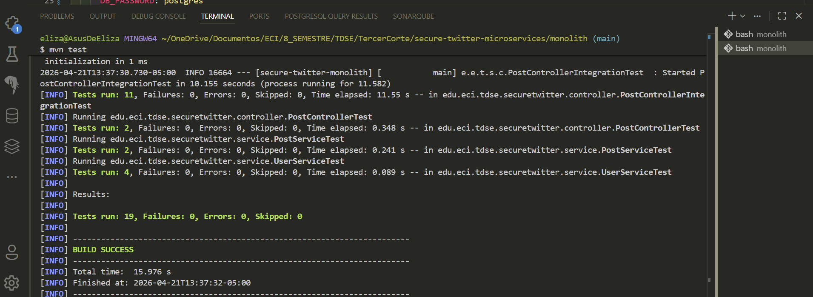

### Test Coverage Summary

| Test Class | Type | Tests | Result |
|---|---|---|---|
| `PostServiceTest` | Unit | 6 | Passed |
| `UserServiceTest` | Unit | 4 | Passed |
| `PostControllerTest` | Unit (MockMvc) | 5 | Passed |
| `PostControllerIntegrationTest` | Integration | 4 | Passed |

### What is tested

- Creating a post with valid content (under 140 characters)
- Rejecting posts that exceed 140 characters
- Rejecting unauthenticated requests to `POST /api/posts`
- Returning the public stream without authentication
- Creating or retrieving a user on first access to `GET /api/me`
- Correct HTTP status codes for all scenarios (200, 201, 400, 401, 403)

**Run the tests locally:**
```bash
cd monolith
mvn test
```

### API calls verification

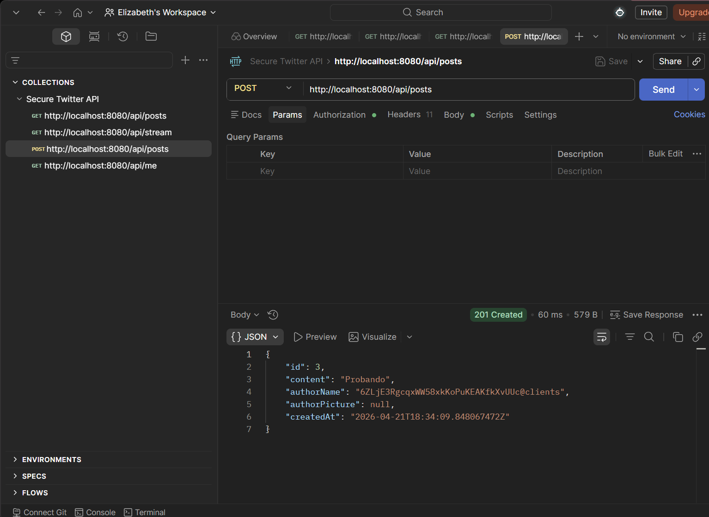

---

## 8. Live Links

| Resource | URL |
|---|---|
| Live Frontend (Vercel) | [https://secure-twitter-microservices-2.vercel.app](https://secure-twitter-microservices-2.vercel.app) |
| API Gateway (Microservices) | `https://3pc1xkfc9f.execute-api.us-east-1.amazonaws.com/prod` |
| Auth0 Tenant | `elizabeth-platform.us.auth0.com` |

**Frontend screenshots:**

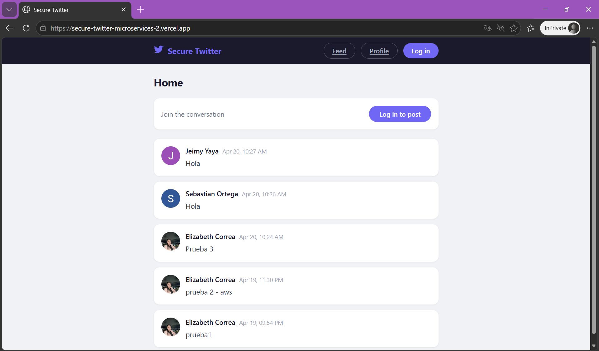

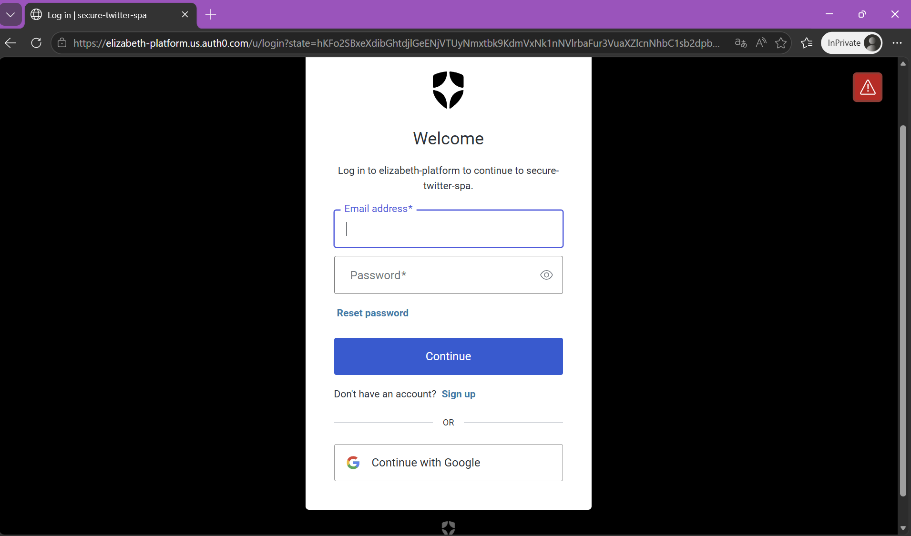

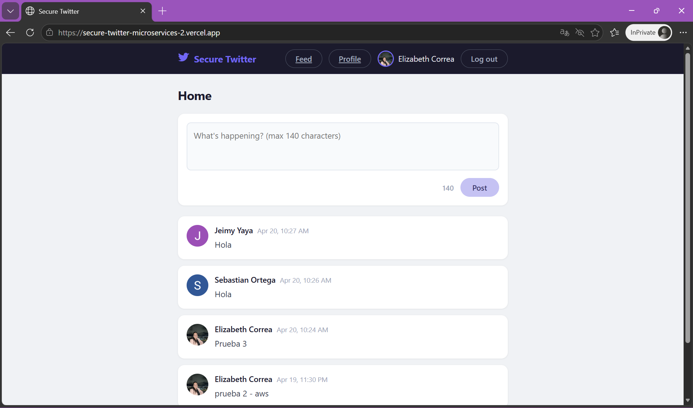

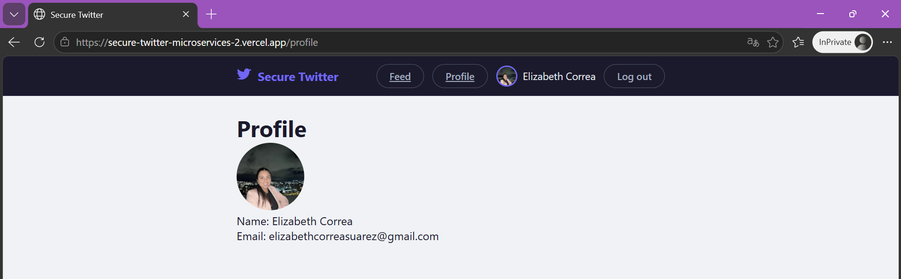

> **Note:** The Swagger UI is only available when running the monolith locally, as the production deployment uses the serverless microservices. A full export of the OpenAPI specification is available at `/v3/api-docs` when running locally.

---

## 9. Video Demonstration

> [Watch the video demonstration on Google Drive](<https://drive.google.com/file/d/189iFlJtDHZ0454LDtzomdNjqXdl1V81q/view?usp=sharing>)


---
